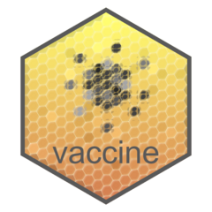

<!-- badges: start -->
  
  [](https://CRAN.R-project.org/package=vaccine)
  
  [](https://github.com/Avi-Kenny/vaccine/actions/workflows/R-CMD-check.yml)
  [](https://app.codecov.io/gh/Avi-Kenny/vaccine?branch=master)
  [](https://CRAN.R-project.org/package=vaccine)
<!-- badges: end -->


# vaccine 

Statistical tools for immune correlates analysis of vaccine clinical trial data

## Overview

**vaccine** is an open-source R package containing various semiparametric and nonparametric statistical tools for immune correlates analysis of vaccine clinical trial data. This includes calculation of summary statistics and estimation of risk, vaccine efficacy, controlled risk, and controlled vaccine efficacy.

## Installation

The latest stable version of **vaccine** can be installed from CRAN using `install.packages()`. The current development version can be installed using `devtools::install_github()`:

```R
install.packages("vaccine")
devtools::install_github(repo="Avi-Kenny/vaccine")
```

<!--## Documentation

The full package documentation can be found at [https://avi-kenny.github.io/SimEngine/](https://avi-kenny.github.io/SimEngine/). All of the CRAN documentation (i.e. the function reference and vignettes) can also be found here.-->

## Bugs reports and feature requests

To submit a bug report or request a new feature, please submit a new [GitHub Issue](https://github.com/Avi-Kenny/vaccine/issues).
