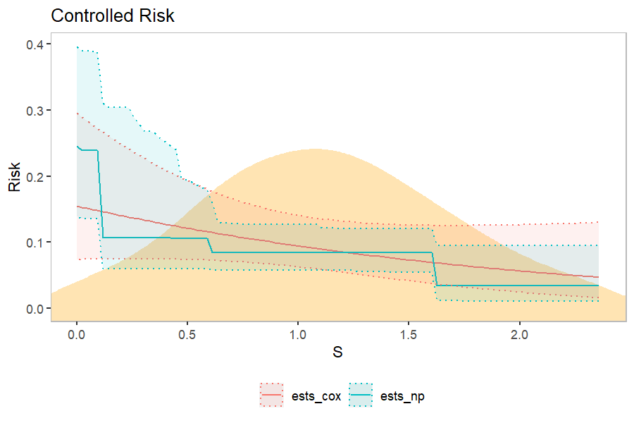

```{R}
library(vaccine)
#> vaccine (version 0.1.0).
#> Type ?vaccine to get started.
```

The `load_data` function takes in raw data and creates a data object that can be accepted by various estimation functions. We use publicly-avaliable data from the HVTN 505 HIV vaccine efficacy trial as our example.

```{R}
data(hvtn505)

dat <- load_data(
  time = "HIVwk28preunblfu",
  event = "HIVwk28preunbl",
  vacc = "trt",
  marker = "IgG_env",
  covariates = c("age","BMI","bhvrisk"),
  weights = "wt",
  ph2 = "casecontrol",
  data = hvtn505
)
```

The `summary_stats` function gives us some useful summaries of the dataset.

```{R}
summary_stats(dat)
#> Number of subjects (vaccine group, phase-1): 1161
#> Number of subjects (placebo group, phase-1): 1141
#> Number of subjects (vaccine group, phase-2): 150
#> Number of subjects (placebo group, phase-2): 39
#> Number of events (vaccine group, phase-1): 27
#> Number of events (placebo group, phase-1): 21
#> Number of events (vaccine group, phase-2): 25
#> Number of events (placebo group, phase-2): 19
#> Proportion of subjects with an event (vaccine group, phase- 1): 0.02326
#> Proportion of subjects with an event (placebo group, phase- 1): 0.0184
#> Proportion of subjects with an event (vaccine group, phase- 2): 0.16667
#> Proportion of subjects with an event (placebo group, phase- 2): 0.48718
```

The `est_overall` function allows us to estimate overall risk in the placebo and vaccine groups, as well as estimate vaccine efficacy, using either a nonparametric Kaplan-Meier estimator or a marginalized Cox model.

```{R}
est_overall(dat=dat, t_0=578, method="KM")
#>   stat   group         est          se    ci_lower   ci_upper
#> 1 risk vaccine  0.04067009 0.008230842  0.02506853 0.05602199
#> 2 risk placebo  0.02879861 0.006563785  0.01622360 0.04121288
#> 3   ve    both -0.41222411 0.430451788 -1.56659984 0.22294979

est_overall(dat=dat, t_0=578, method="Cox")
#>   stat   group         est          se    ci_lower   ci_upper
#> 1 risk vaccine  0.04177642 0.008111679  0.02847302 0.06090588
#> 2 risk placebo  0.02938706 0.006486545  0.01901930 0.04514638
#> 3   ve    both -0.42159246 0.417915188 -1.52937491 0.20101796
```

The `est_ce` function allows us to compute controlled effects curves; see [Gilbert, Fong, Kenny, and Carone 2022](https://academic.oup.com/biostatistics/article-abstract/24/4/850/7320953) for more detail.

```{R}
ests_cox <- est_ce(dat=dat, type="Cox", t_0=578)
ests_np <- est_ce(dat=dat, type="NP", t_0=578)
#> Warning: package 'SuperLearner' was built under R version
#> 4.2.3
#> Loading required package: nnls
#> Loading required package: gam
#> Warning: package 'gam' was built under R version 4.2.3
#> Loading required package: splines
#> Loading required package: foreach
#> Loaded gam 1.22-2
#> Super Learner
#> Version: 2.0-28
#> Package created on 2021-05-04
```

The `plot_ce` function produces basic plots of CR or CVE curves.

```{R}
plot_ce(ests_cox, ests_np)
```


Use the `density` option to add a kernel density estimate of the distribution of the marker to the plot background.



Use the `trim` function to truncate the display of the curves, based on quantiles of the marker distribution. It is recommended to truncate the display of the nonparametric curves, as estimates can be biased towards the endpoints of the marker distribution.

```{R}
ests_cox <- trim(ests_cox, dat=dat, quantiles=c(0.05,0.95))
ests_np <- trim(ests_np, dat=dat, quantiles=c(0.1,0.9))
plot_ce(ests_cox, ests_np, density_type="kde", dat=dat)
```


Plots generated using `plot_ce` can be further customized using `ggplot2` functions. For example, we change the plot labels and colors as follows.

```{R}
library(ggplot2)
my_plot <- plot_ce(ests_cox, ests_np, density_type="kde", dat=dat)

my_plot +
  labs(x="IgG Env (S)") +
  scale_color_manual(labels = c("Cox model", "Nonparametric"),
                     values = c("darkorchid3", "deepskyblue3")) +
  scale_fill_manual(labels = c("Cox model", "Nonparametric"),
                    values = c("darkorchid3", "deepskyblue3"))

```


